<p align="center">
  
</p>

<p align="center">
  <a href="https://www.linkedin.com/in/amirdalirii/"></a>
  <a href="https://x.com/AgoodAmir"></a>
  <a href="https://asapps.studio/"></a>
</p>

<p align="center">
  <em>Thoughtful architecture. Polished experiences. Software people can trust.</em>
</p>

---

## `> about_me`

I’m a **Senior iOS Engineer** with more than a decade of experience building and shipping production applications across Apple platforms.

My work spans **fintech, banking, authentication, IoT, media, subscriptions, device connectivity, and consumer products**. I’ve contributed to projects involving **Bragi, KoçSistem, NEC Corporation of America, Conexus Credit Union, Coca-Cola, Total Oil, and Tuborg**.

```swift
struct Amir: ApplePlatformEngineer {
    let experience = "10+ years"
    let craft = ["Swift", "SwiftUI", "UIKit", "Architecture"]
    let priorities = ["Quality", "Performance", "Privacy", "Trust"]
    let studio = URL(string: "https://asapps.studio")!

    func build() -> Product {
        .thoughtful().tested().polished().shipped()
    }
}
```

## `> engineering_toolkit`

<p align="center">
  
</p>

<table>
  <tr>
    <td width="50%" valign="top">
      <h3>📱 Apple Platforms</h3>
      <p>Swift · SwiftUI · UIKit · Combine · RxSwift · AVFoundation · StoreKit</p>
    </td>
    <td width="50%" valign="top">
      <h3>🏗 Architecture</h3>
      <p>MVVM · MVVM-C · Clean Swift · Modular Design · Swift Package Manager</p>
    </td>
  </tr>
  <tr>
    <td width="50%" valign="top">
      <h3>🧪 Quality & Delivery</h3>
      <p>Unit Testing · Profiling · Code Review · Fastlane · Bitrise · GitHub Actions</p>
    </td>
    <td width="50%" valign="top">
      <h3>📡 Product Systems</h3>
      <p>Subscriptions · Firebase · Analytics · Deep Links · WebSockets · Device Pairing</p>
    </td>
  </tr>
</table>

## `> as_apps_studio`

I’m the founder of [**AS Apps Studio**](https://asapps.studio/) — an independent studio creating beautifully designed, privacy-first applications for everyday digital life.

| Product | Purpose |
|:--|:--|
| **Auth Kit** | Secure 2FA codes, passwords, passkeys, and biometric access |
| **AS Rock ID** | AI-powered rock and mineral identification |
| **AsRemote** | Universal remote control for Samsung, LG, Roku, and more |
| **AS Cleaner** | Duplicate detection, blurry-photo discovery, and contact cleanup |
| **CronCraft** | A visual cron expression builder and decoder |
| **Receipt Rescue** | AI-assisted receipt organization for taxes and bookkeeping |
| **ASvpn** | A simple, privacy-focused VPN experience |

<p align="center">
  <a href="https://asapps.studio/"><strong>Explore the studio →</strong></a>
</p>

## `> contribution_activity`

<picture>
  <source media="(prefers-color-scheme: dark)" srcset="https://raw.githubusercontent.com/AmirDaliri/AmirDaliri/output/github-contribution-grid-snake-dark.svg" />
  <source media="(prefers-color-scheme: light)" srcset="https://raw.githubusercontent.com/AmirDaliri/AmirDaliri/output/github-contribution-grid-snake.svg" />
  
</picture>

---

<p align="center">
  <strong>Build for people · Design for change · Ship with care</strong>
</p>

<p align="center">
  <a href="https://www.linkedin.com/in/amirdalirii/">LinkedIn</a>
  ·
  <a href="https://x.com/AgoodAmir">X</a>
  ·
  <a href="https://asapps.studio/">AS Apps Studio</a>
</p>
